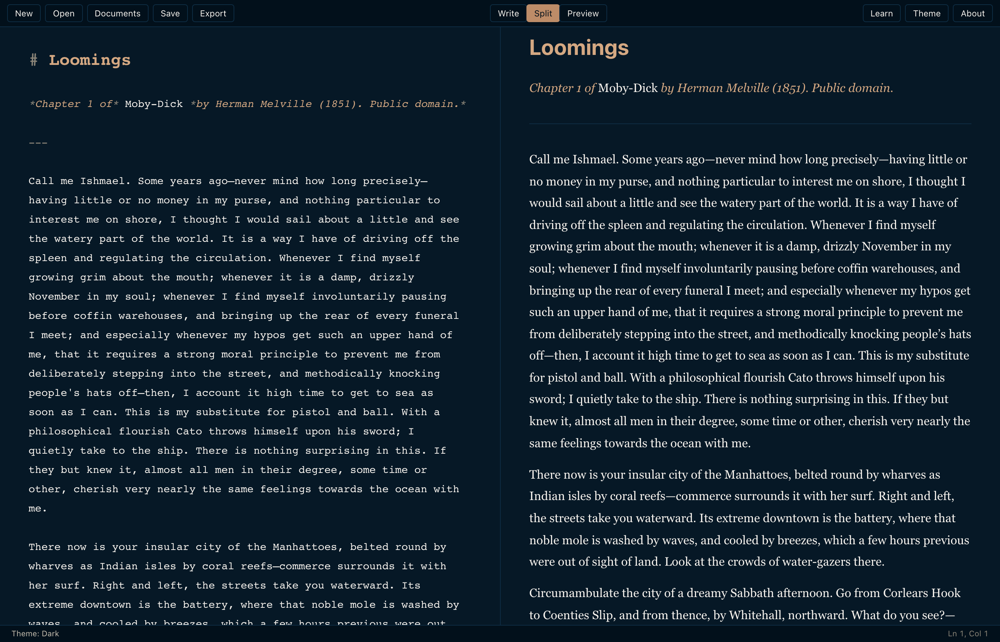

# Loomings

A markdown editor in your browser. Write, share with students, teach
markdown side by side. The shapes loom before they take form.

Built with CodeMirror 6 and markdown-it, served as static files. No
account, no server-side state: nothing you type leaves your machine
unless you put it in a link.

**Use it:** [loomings.tiagojacinto.eu/app](https://loomings.tiagojacinto.eu/app)
**Site:** [loomings.tiagojacinto.eu](https://loomings.tiagojacinto.eu)
**Changelog:** [CHANGELOG.md](CHANGELOG.md)



## What it does

### Write
- Real markdown in the editor: bold reads bold, headings read as headings, code reads as code.
- Shortcuts: **⌘B / ⌘I** wrap, **⌘\`** code, **⌘K** link. Lists continue on Return, stop on a second Return.
- Smart typography (curly quotes, em dashes, ellipses), YAML frontmatter dimmed.
- **Outline** (⌘P), **find and replace** (⌘F), **focus mode** (⌘⇧D), typewriter scrolling, word goal, reading time, column width.
- **Three views**: Write, Split (⌘\), Preview (⌘⇧P). Split keeps the two panes in step as you scroll either one.
- **Export**: Markdown, standalone HTML in the current theme, or Print / PDF of the rendered document.

### Share and teach
- **Copy share link** puts the whole document, compressed, in the URL fragment. Whoever opens it gets the text in their own editor. Nothing is uploaded; the fragment never reaches the server.
- **Lessons**: six bundled exercises (basics, lists and quotes, links and images, code, tables, frontmatter) under the Learn menu, or `?lesson=basics` and so on. They open in Split view and are written to demonstrate themselves.
- **Cheatsheet** drawer (⌘?) with syntax and shortcuts.

### Keep
- **Files** on disk in Chrome and Edge (File System Access API), with recent files remembered.
- **Documents in this browser** everywhere else (Safari, Firefox, iPad): Save keeps the draft in IndexedDB, and the Documents menu lists, reopens and deletes them.
- **Crash recovery**: the buffer is scratched to IndexedDB as you type and offered back on the next visit.
- **Installable**: a web manifest and service worker make it an app that works offline and, on Chromium, opens `.md` files from the OS.

### Themes
Four families from the author's design systems, each with dark and light modes and a system-follow setting (Theme menu, or ⌘⇧T to cycle modes):

| Family | Dark | Light | Source |
|---|---|---|---|
| **Pequod** (default) | Below deck | Parchment | [pequod](https://github.com/tiagojct/pequod) |
| **Glauca** | Profundum | Pruina | [glauca](https://github.com/tiagojct/glauca) |
| **Try-Works** | Try-Fire | True Lamp | [try-works](https://github.com/tiagojct/try-works) |
| **Ambergris** | Dark | Light | [ambergris](https://github.com/tiagojct/ambergris) |

Every palette is checked for WCAG contrast floors by the test suite.

## Keyboard shortcuts

| Action | Shortcut |
|---|---|
| Save / Save As | ⌘S / ⌘⇧S |
| Bold / Italic / Code / Link | ⌘B / ⌘I / ⌘\` / ⌘K |
| Find | ⌘F |
| Jump to heading | ⌘P |
| Split view | ⌘\ |
| Preview | ⌘⇧P |
| Cheatsheet | ⌘? |
| Focus mode | ⌘⇧D |
| Stats | ⌘⇧L |
| Column width | ⌘⇧W |
| Theme mode | ⌘⇧T |
| Word goal | ⌘⇧G |
| Font size | ⌘= / ⌘- |

⌘ is Ctrl on Windows and Linux.

## Develop

```sh
npm install
npm run dev        # Vite on http://127.0.0.1:1420/app/
npm test           # Vitest: palettes, share links, lessons
npm run build      # static site in dist/ (app at /app/, plus sw.js)
npm run preview    # serve dist/ on http://127.0.0.1:4173/app/
```

## Self-host

The Docker image serves `docs/` (landing page) at the root and the app at
`/app`, via nginx with a strict Content-Security-Policy.

```sh
docker build -t loomings .
docker run --rm -p 8081:80 loomings
```

`docker-compose.yml` is the VPS shape: a loopback-bound port for a reverse
proxy in front, plus a [watchtower](https://containrrr.dev/watchtower/)
sidecar. `.github/workflows/docker-publish.yml` pushes
`ghcr.io/tiagojct/loomings` on every push to main and on version tags;
`:latest` only moves on tags, so the VPS redeploys on releases.

## Project layout

```
loomings/
  src/
    index.html          # app shell: toolbar, panes, menus, cheatsheet, dialogs
    editor.js           # the editor: CodeMirror setup, views, sync, menus, boot
    browser.js          # file I/O, IndexedDB documents/scratch/recents, PWA hooks
    palettes.js         # the four colour families (single source of colour)
    share.js            # document ⇄ URL fragment (deflate + base64url)
    lessons.js          # index of lessons/*.md
    sw-template.js      # service worker, filled in at build time
    style.css           # layout, menus, print stylesheet
    *.test.js           # Vitest
  lessons/              # NN-slug.md, bundled into the app
  public/               # manifest.webmanifest + icons, copied verbatim
  examples/loomings.md  # Moby-Dick chapter 1
  docs/                 # landing page, served at the site root
  icons/ scripts/       # icon sources and build pipeline
  Dockerfile nginx.conf docker-compose.yml
  vite.config.js        # base /app/, service-worker plugin
```

## Desktop app

Loomings 1.x was a Tauri desktop app for macOS, Windows and Linux. That
line stopped at v1.2.1; the last desktop build is kept as the
`desktop-final` branch and the `v1.2.1-desktop-final` tag, with installers
on the [releases page](https://github.com/tiagojct/loomings/releases).
The web app covers the same editor, and installing it from the browser
gives back an app icon and offline use.

## License

MIT, see [LICENSE](LICENSE). Chapter 1 of *Moby-Dick* is public domain.
